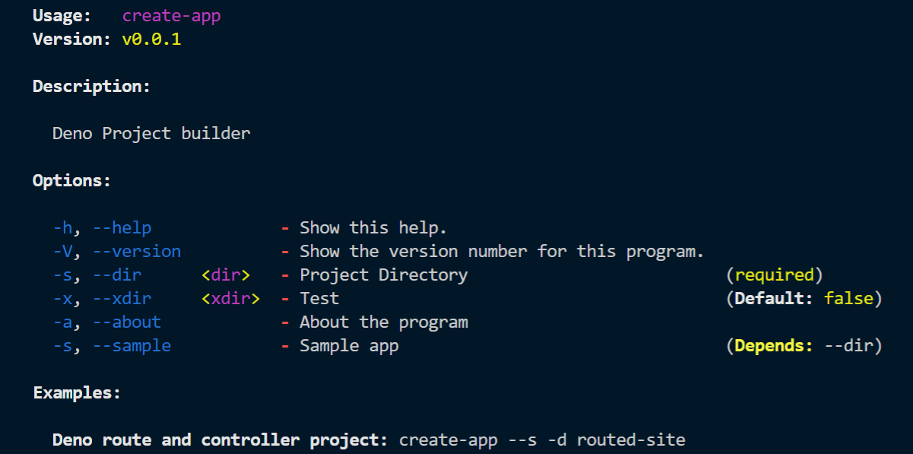

# About

This is a CLI Tool for primarily developed for Deno projects and it is made in Deno. The tool will generate components structure and Project structure for fast coding.

 

### Modules used
* cliffy 
* fs
## How to Install the app
Name the as you like using `-n` option , make sure the `deno` is installed on your system.
```
 deno install --allow-net --allow-read --unstable -n create-deno  https://raw.githubusercontent.com/manojap/Deno-CLI-create-app-master/1.0/mod.ts
```
More documentation can be found under the `Doc`.

## How to use
On the command prompt you can use it as follows
```
create-deno --sample -d myproject // this will create a project in your current folder

create-deno -h // will get you a list cof options with sample usage

> the name (create-app) depends on what name you are choosing while installation
```

## Run the project
After the creation of project you can `cd` into the directory and run the project as (if you are a beginner it will be helpfull)
```
deno run --allow-read --allow-net --unstable --allow-write  mod.ts
```
## Open source
Everybody welcome to join , clone the repo and have a look. 
 
## Escape
More project support coming soon. Suggestions and comments are welcome.
[blog](http://developerm.dev)
